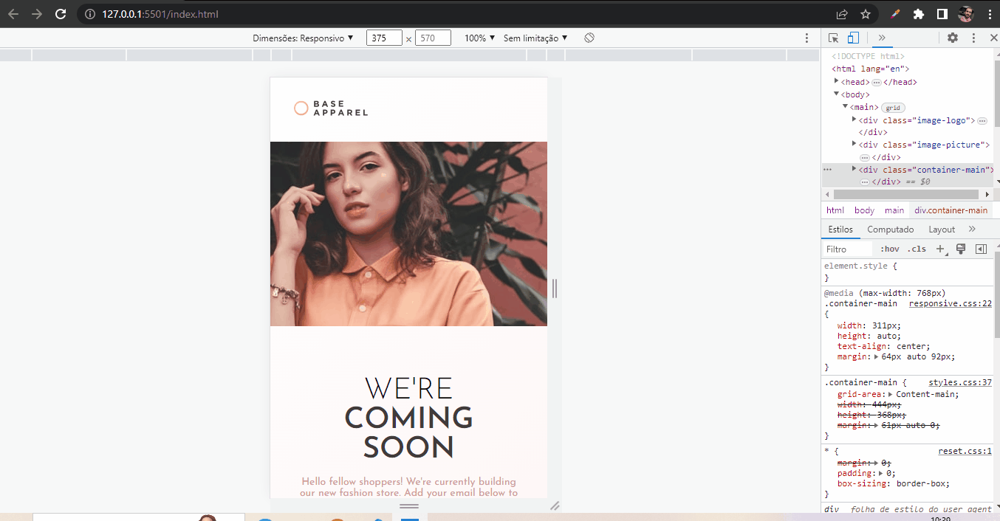

# base-apparel-coming-soon-page

Descobri que atravez do ```display: grid; ``` posso usar outras própriedades. Assim eu consigo malipular a posição dos elementos conforme o tamanho da tela para deixar o conteúdo com a responsividade adequada.

## Tecnologias utilizadas:
- HTML;
- CSS;
- JavaScript;

